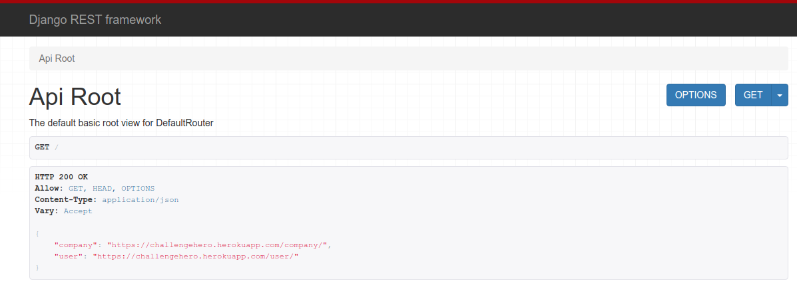

## Requisitos

- Django 3.0.6+
- Python 3.6+
- Django Rest Framework
- Postgress
- Testes Unitários

## Tecnologias Utilizadas

- Docker
- Heroku
- Postman

## Enpoints 
### 1. Cadastro
#### 1.1 Usuários
#### Para cadastrar um usuário via Postman será necessário informar o nome(first_name), sobrenome(last_name), usuário(username) e email do usuário.
Então acesse o seguinte endpoint pelo método POST: https://hero-challenge.herokuapp.com/user/
```json
{
    "first_name": "Teste",
    "last_name": "Teste",
    "username": "teste",
    "email": "teste@email.com"
}
```
Retorno:
```json
{"id":3,"first_name":"Teste","last_name":"Teste","username":"teste","email":"teste@email.com","companies":[]}
```
#### 1.2 Empresas
#### Para cadastrar uma empresa via Postman será necessário informar o nome(name), cnpj, e usuário(user) da empresa.
Então acesse o seguinte endpoint pelo método POST: https://hero-challenge.herokuapp.com/user/
```json
{
    "name": "Teste",
    "cnpj": "11111111111111",
    "user": [3]
}
```
Retorno:
```json
{"id":3,"name":"Teste","cnpj":"11111111111111","user":[3]}
```
### 2. Listagem
#### 2.1 Usuários
Para listar um usuário pelo seu username e saber a qual ou quais empresa ele pertence, acesse o seguinte endpoint pelo método GET: https://hero-challenge.herokuapp.com/user/username

Retorno:
```json
{
    "id": 3,
    "first_name": "Teste",
    "last_name": "Teste",
    "username": "teste",
    "email": "teste@email.com",
    "companies": [
        {
            "id": 3,
            "name": "Teste",
            "cnpj": "11111111111111",
            "user": [
                3
            ]
        }
    ]
}
```
#### 2.2 Empresas
Para listar todas as informações da empresa e seus usuários, acesse o seguinte endpoint pelo método GET: https://hero-challenge.herokuapp.com/company

Retorno:
```json
[
    {
        "id": 1,
        "name": "COMPANY HERO LTDA",
        "cnpj": "20240272000176",
        "user": [
            1,
            2
        ]
    },
    {
        "id": 2,
        "name": "ENERGISA S.A",
        "cnpj": "00864214000106",
        "user": [
            1
        ]
    },
    {
        "id": 3,
        "name": "Teste",
        "cnpj": "11111111111111",
        "user": [
            3
        ]
    }
]
```

### Testes Unitários

Foi criado um módulo para o código de teste, com arquivos separados para models e views:

- company -> tests -> test_models.py
- company -> tests -> test_views.py
- user -> tests -> test_views.py

A maneira mais fácil para executar todos os testes é usar o comando:

```json
python3 manage.py test
```
## Heroku
#### APP: challengehero
#### URL da aplicação: https://challengehero.herokuapp.com/



